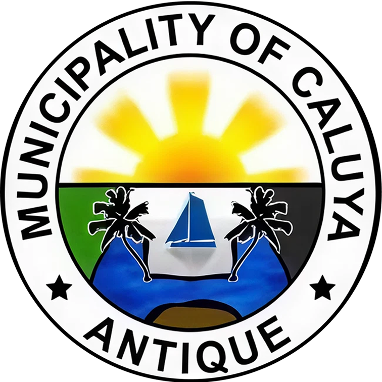

# 🦀 Municipality of Caluya, Antique — Official LGU Portal & E-Governance Platform

<div align="center">
  
  <br/>
  <h3>Republika ng Pilipinas • Lalawigan ng Antique</h3>
  <h1>MUNICIPALITY OF CALUYA</h1>
  <p><strong>Premier Archipelagic Gateway • Smart Island Governance • 18 Resilient Barangays</strong></p>
  <p><em>ZIP Code: 5711 • Western Visayas (Region VI)</em></p>

  <p>
    <a href="https://elgu-caluya-antique-news.e.gov.ph/home">Official e-LGU Source</a> •
    <a href="https://github.com/bluegene37/caluya">GitHub Repository</a> •
    <a href="#-executive-proposal-for-the-vice-mayor">Vice Mayor Proposal</a> •
    <a href="#-citizen-services--emergency-rescue">Citizen e-Services</a>
  </p>
</div>

---

## 📌 Overview

This repository contains the official modern web portal and digital governance proposal prototype for the **Local Government Unit (LGU) of Caluya, Antique, Philippines**.

Caluya is an archipelagic first-class municipality in northern Antique composed of multiple island groups—principally **Caluya Island, Semirara Island, Sibay Island, Sibato, and Liwagao**. Due to the island geography, constituents frequently face long and costly inter-island pumpboat voyages (often ₱400–₱800 round trip) and seasonal monsoons (*habagat* and *amihan*) to access essential municipal services at the Poblacion mainland.

This project delivers:
1. **A Comprehensive Citizen Gateway:** Complete access to 24/7 MDRRMO marine rescue, Rural Health Units (RHU 1 & RHU 2), medicine inventories, MSWDO social welfare, civil registry, e-BPLS business permits, real property tax calculators, and island tourism.
2. **An Executive E-Governance Proposal & Legislative Pitch:** Tailored directly for the **Municipal Vice Mayor (Hon. Genevive L. Reyes)** and the **Sangguniang Bayan ng Caluya**, providing an interactive slide deck, printable formal brief, and draft municipal resolution for legislative sponsorship and funding under the 20% Municipal Development Fund (MDF) and 5% LDRRM Fund.

---

## 🏛️ Executive Proposal for the Vice Mayor

Built into the header is an interactive **Vice Mayor Proposal** modal featuring:
- **7-Slide Legislative Pitch Deck:** Clear presentation addressing island isolation, economic benefits (~₱15M annual citizen savings on boat fares), and phased rollout across all 18 barangays.
- **Draft Sangguniang Bayan Resolution:** Modeled as **SB Resolution No. 2026-088 (Series of 2026)** sponsored by Vice Mayor Hon. Genevive L. Reyes and the Committee on Rules, Laws & Ordinances.
- **Print-Ready Document Letterhead:** Formal layout formatted with the official Caluya municipal seal, ready for council deliberations or PDF export (`window.print()`).
- **Fiscal Feasibility:** Grounded in statutory mandates (RA 7160 Local Government Code, RA 11032 Ease of Doing Business, and DILG SGLG compliance).

---

## 🌟 Key Features & Modules

### 1. 24/7 Rescue & MDRRMO Emergency Command
- **Live Marine Sea Advisory & Gale Warning Board:** Visual warning indicators for sea condition, wave height, and passenger banca clearance.
- **Emergency Hotlines:** Instant click-to-call for MDRRMO 911 (`0998-765-4321`), Coast Guard Sub-Station Caluya, PNP Caluya, and BFP Fire Station.
- **Marine Radio Frequency:** Monitoring VHF Channel 16 for inter-island pumpboats and fisherfolk vessels.
- **Sea Medevac Protocol:** Fast coordination protocol connecting RHU clinics on Semirara and Sibay with mainland hospital vessels.

### 2. Public Health & Medicine Tracking (RHU 1 & RHU 2)
- **Facility Directory:** Information for RHU 1 (Poblacion Mainland) and RHU 2 (Semirara Island).
- **Doctors to the Barrios Consultation Schedules:** Weekly island rotation calendars.
- **Essential Free Medicine Inventory Tracker:** Live search for municipal medicine stocks (Hypertension, Antibiotics, Insulin, Anti-Venom/Tetanus, Prenatal vitamins).
- **Tele-Consultation Request:** Online intake form for remote island barangays.

### 3. Public & Social Assistance (MSWDO)
- **Assistance to Individuals in Crisis Situations (AICS):** Medical, burial, and sea transport fare assistance.
- **Senior Citizens & PWD Registry:** Online form for municipal ID processing and pension verification.
- **Emergency Food & Relief Distribution:** Calamity relief tracking during monsoon season.

### 4. Interactive Citizen e-Services & Financial Calculators
- **e-BPLS Business Permit Calculator:** Instant fee estimates for new applications and renewals based on gross sales.
- **Civil Registry Certificate Service:** Step-by-step guidance and fee breakdown for Birth, Marriage, and Death certificates.
- **Real Property Tax (RPTax) Assessment:** Interactive valuation calculator for residential, commercial, and agricultural island parcels.
- **Mayor’s Action Desk (e-Reklamo):** Direct citizen feedback and ticketing channel with reference code generation.

### 5. Caluya e-Citizen Mobile Application (Sample Dummy APK & PWA)
- **Direct Sample Download:** Constituents and evaluators can download the sample demonstration Android APK package (`public/downloads/caluya-citizen-app-v1.0.apk`) directly from the portal with zero Play Store account barriers.
- **Interactive Smartphone Simulator:** Test-drive mobile features right in the desktop or mobile browser (one-tap Maritime SOS simulation, Caluya Resident e-ID QR card, RHU medicine inventory checker).
- **Offline Island Resilience:** Designed for low/no-connectivity island scenarios with local directory caching and SMS fallback dispatch during monsoons.
- **iOS PWA Support:** Step-by-step installation instructions for iPhone Safari users ("Add to Home Screen").

### 6. Island Explorer & Tourism Showcase
- Dedicated interactive profiles for Caluya’s major islands and islets:
  - **Caluya Mainland:** Poblacion, white sand beaches, coconut crab (*Tatus*) sanctuaries.
  - **Semirara Island:** Industrial powerhouse, energy security, and corporate-community healthcare facilities.
  - **Sibay Island:** Seaweed (*Tambalang*) farming center and historical cultural sites.
  - **Sibato & Liwagao:** Pristine coral atolls, powdery sandbars, and diving eco-destinations.
- Highlighting the world-renowned **Tatusan Festival** (celebrating the prized *Birgus latro* coconut crab) and sustainable conservation policies.

### 7. Modern Archipelagic UI / UX
- **Dynamic Hero Image Slider:** Automated carousel with curated island photography and dark scrim overlays for high contrast readability.
- **Expanded Top Navigation:** Wide layout (`max-w-[1850px]`) that prevents button wrapping across resolutions.
- **Dark & Light Mode Switcher:** Instant theme toggling placed at the far right of the navigation, defaulting to **Light Mode**.
- **Responsive Architecture:** Fully accessible across mobile smartphones, tablets, and desktop workstations.

---

## 🛠️ Technology Stack

| Layer | Technology |
|---|---|
| **Framework** | [Vue 3](https://vuejs.org/) (Composition API, `<script setup>`) |
| **Build Tool** | [Vite 6](https://vitejs.dev/) (Lightning-fast HMR and bundling) |
| **Styling** | [Tailwind CSS v4](https://tailwindcss.com/) (Modern CSS tokens & responsive utilities) |
| **Icons** | [Lucide Vue Next](https://lucide.dev/) (Crisp, accessible SVGs) |
| **Fonts** | Inter / Outfit system font hierarchy |
| **Assets** | Official Municipal Logos & CDN imagery from DICT e-LGU |

---

## 📁 Project Structure

```
Caluya/
├── public/
│   ├── downloads/
│   │   └── caluya-citizen-app-v1.0.apk # Sample evaluation APK package (601 KB)
│   └── images/
│       ├── caluya-logo.png      # Official Circular Seal (756x756 RGBA)
│       └── caluya-banner.png    # Official Horizontal Municipal Banner (3372x800 RGBA)
├── src/
│   ├── assets/
│   │   └── main.css             # Tailwind CSS v4 setup & base rules
│   ├── components/
│   │   ├── TopBar.vue           # PST Clock, Sea advisories
│   │   ├── HeaderNav.vue        # Wide navbar, official logo, theme toggle, proposal trigger
│   │   ├── HeroSection.vue      # Big hero image slider with text overlays
│   │   ├── EmergencyRescueHub.vue # 24/7 Rescue, Coast Guard, MDRRMO Gale Warning
│   │   ├── HealthServicesHub.vue # RHU 1 & RHU 2 telemedicine, medicine inventory tracker
│   │   ├── PublicServicesDirectory.vue # MSWDO, Senior/PWD, Agriculture, Scholarship
│   │   ├── ServicesHub.vue      # e-BPLS, Civil Registry, RPTax calculator, e-Reklamo
│   │   ├── MobileAppSection.vue # Caluya e-Citizen Mobile App showcase & dummy APK download
│   │   ├── IslandExplorer.vue   # Caluya, Semirara, Sibay, Sibato, Liwagao profiles
│   │   ├── TourismShowcase.vue  # Tatusan Festival, Coconut Crab, Eco-tourism
│   │   ├── LeadershipSection.vue # Mayor, Vice Mayor showcase & Sangguniang Bayan directory
│   │   ├── TransparencySection.vue # DILG Full Disclosure, BAC bids, SGLG mandates
│   │   ├── ProposalModal.vue    # Vice Mayor slide deck & formal document
│   │   └── FooterSection.vue    # Republic standards, FOI, Data Privacy, official seal
│   ├── data/
│   │   └── caluyaData.js        # Comprehensive municipal dataset, emergency lines, proposal text
│   ├── App.vue                  # Main application orchestrator & theme state
│   └── main.js                  # Vue entrypoint
├── index.html                   # HTML template with Caluya branding
├── package.json                 # Project dependencies & scripts
├── vite.config.js               # Vite configuration
└── README.md                    # Project documentation
```

---

## 🚀 Getting Started

### Prerequisites
- [Node.js](https://nodejs.org/) version 18.0.0 or higher
- [npm](https://www.npmjs.com/) version 9.0.0 or higher

### Installation

1. **Clone the repository:**
   ```bash
   git clone https://github.com/bluegene37/caluya.git
   cd caluya
   ```

2. **Install project dependencies:**
   ```bash
   npm install
   ```

3. **Start the development server:**
   ```bash
   npm run dev
   ```
   Open your browser at `http://localhost:5173` (or the URL printed in the terminal).

4. **Build for production:**
   ```bash
   npm run build
   ```
   The compiled static assets will be output to the `dist/` directory, ready to be hosted on any static hosting platform (Vercel, Cloudflare Pages, Firebase Hosting, GitHub Pages, or DICT Government servers).

5. **Preview the production build locally:**
   ```bash
   npm run preview
   ```

---

## 📜 Legal & Governance Compliance

This web application and digital governance proposal adhere to Republic of the Philippines standards:
- **Republic Act No. 7160:** The Local Government Code of 1991 (Section 16 - General Welfare Clause).
- **Republic Act No. 11032:** Ease of Doing Business and Efficient Government Service Delivery Act of 2018 (Zero-Contact Policy & Digital Automation).
- **Republic Act No. 10173:** Data Privacy Act of 2012 (Securing citizen personal records and tax inquiries).
- **DILG Memorandum Circulars:** Full Disclosure Policy Portal (FDPP) and Seal of Good Local Governance (SGLG) criteria.

---

## 🤝 Attribution & Credits

- **Municipality of Caluya Official Portal:** Assets and official seal referenced from [DICT e-LGU Caluya News](https://elgu-caluya-antique-news.e.gov.ph/home).
- **Prepared for:** Office of the Municipal Vice Mayor **Hon. Genevive L. Reyes** and the members of the **Sangguniang Bayan ng Caluya**, Province of Antique.
- **Author Attribution:** Designed and developed by **Gene** (October 2026).
